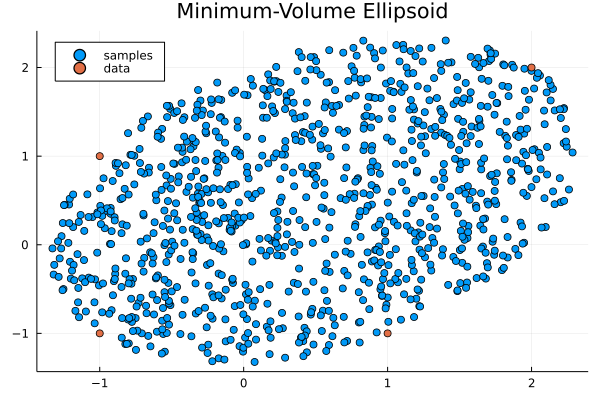

# MinimumVolumeEllipsoids.jl

[](https://github.com/FriesischScott/MinimumVolumeEllipsoids.jl/actions/workflows/ci.yml)
[](https://codecov.io/gh/FriesischScott/MinimumVolumeEllipsoids.jl)

MinimumVolumeEllipsoids.jl is a Julia module which implements algorithms to compute Minimum-Volume Ellipsoids (MVE) from given data. The algorithms are implemented as defined in _Minimum-volume ellipsoids: Theory and algorithms_ by Michael J. Todd. The code has been adapted from the original Matlab implementation supplied with the book. For the original code see here: http://archive.siam.org/books/mo23/

In addition to computing the MVE this module also includes a function to sample uniformly over the ellipsoid using an algorithm proposed by Dezert & Musso.

## Usage

To compute the minimum-volume enclosing ellipsoid centered at the origin for a set of four points run the following code:

```julia
using MinimumVolumeEllipsoids

X = [
    -1 -1  1 2
     1 -1 -1 2
]

ϵ = minimum_volume_ellipsoid(X, centered=true)
```
This results in an ellipsoid with the center `ϵ.x`
```julia
2-element Vector{Float64}:
 0.0
 0.0
```
and the shape matrix `ϵ.H`
```julia
2×2 PDMat{Float64, Matrix{Float64}}:
  0.625  -0.375
 -0.375   0.625
```

To relax the centered condition and compute the optimal minimum-volume enclosing ellipsoid simply omit the `centered` keyword
```julia
ϵ = minimum_volume_ellipsoid(X)
```

To create uniform random samples over either ellipsoid simply run
```julia
U = rand(ϵ, 1000)
```

<div float="left">


</div>

## References

Dezert, J., & Musso, C. (2001). An efficient method for generating points uniformly distributed in hyperellipsoids. In _Proceedings of the Workshop on Estimation, Tracking and Fusion: A Tribute to Yaakov Bar-Shalom_.

Todd, M. J. (2016). _Minimum-volume ellipsoids: Theory and algorithms_. Society for Industrial and Applied Mathematics. https://doi.org/10.1137/1.9781611974386
